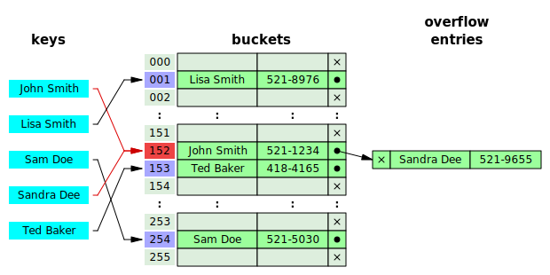

# Module 1: Data Structures on the Internet Computer

## Outline

1. [Tradeoffs in data structure design](#tradeoffs-in-traditional-data-structures)

   * [Linked List vs Array](#linked-list-vs-array)
   * [Common Data Structures](#common-data-structures)

2. [Data structures in Motoko](#data-structures-in-motoko)

   * [Pure vs Object-Oriented](#pure-vs-object-oriented)
   * [Migration and Upgrading Canisters](#Migration-and-Upgrading-Canisters)
   * [Bigmap](#bigmap)

## Tradeoffs in Traditional Data Structures

Data structures enable efficient data storage and come in a wide variety of forms. The optimal data structure for a given task depends on the situation and program priorities; understanding the various tradeoffs inherent in common data structures is essential to using them effectively. 

One common tradeoff exhibited in many data structures is that between **memory** and **lookup speed**. Often, data structures that take up more memory allow for greater lookup speed and vice versa.

### Linked List vs Array

To better understand the aforementioned tradeoff between memory and lookup time, consider the characteristics of **arrays** compared to **linked lists**. An **array** is a fixed-length data structure with constant [O(1)] lookup time. Once an array of a specified size is created, you can't increase its capacity without creating an entirely new array. As a result, the tradeoff for this superb lookup time is reduced flexibility (making arrays poor for dynamically growing/shrinking databases) and increased memory required (you may need to allocate more space than needed to memory if unsure of the exact size required).

<p align="center">  </p>

<p align="center"> <i>Array indices. Source: <a href="https://dzone.com/articles/data-structures-and-their-applications">Dzone</a></i></p>

Conversely, a **linked list** is a dynamically-sized data structure consisting of many nodes, each of which contains a specified data value and a pointer to the next node in the list. If you want to add a new element to the list, you just add a new pointer to the structure. The tradeoff for this increased flexibility, however, is that the lookup time is **O(n)**. This is because if you want to find the data value at the last node in the list, you must first traverse the entire linked list. The head (first node) of the linked list is typically the only location that's directly stored; all other node locations are stored in the preceding node.

Tradeoffs may also exist in the insertion or deletion time of a given data structure. These times depend on the form of insertion/deletion that takes place. For example, inserting at the beginning of a linked list is **O(1)**, whereas inserting an element at the end of the linked list is **O(n)**.

<p align="center">  </p>

<p align="center"> <i>Singly linked lists. Source: <a href="https://en.wikipedia.org/wiki/Linked_list#/media/File:Singly-linked-list.svg">Linked List Wiki</a></i></p>

### Common Data Structures

#### Hash Table

A **hash table** is a data structure consisting of an array and corresponding linked lists. Data is stored in key-value pairs, where the key corresponds to a particular index in the array. In the example shown below, consider a hash table intended to store the phone number (the value) for a given person (the key). We must use a **hash function** to find the particular index that a person's phone number is stored in. This hash function takes in the person's name and outputs an integer (from 0 to the array size) corresponding with the indices of the array. 

This, however, creates a problem: what happens when two distinct names result in the same index? This is bound to happen when the number of data values exceeds the size of the fixed array. Such an event, called a **collision**, is resolved by forming a linked list at that array index. In the diagram below, "Sandra Dee" hashes to the same index, 152, as "John Smith." As a result, the "John Smith" result just points to the location of "Sandra Dee" in the linked list, which can then be traversed to find the stored value for "John Smith".

<p align="center">  </p>
<p align="center"> <i>Hashing names to indices in a hash table. Source: <a href="https://en.wikipedia.org/wiki/Hash_table#/media/File:Hash_table_5_0_1_1_1_1_0_LL.svg"> Hash Table Wiki</a></i></p>
<center></center>

Hash tables are especially useful because they offer both dynamically-sized data storage while also maintaining fast lookup times. In this case, the essential tradeoff is between array size (memory) and lookup speed. A smaller array requires less up-front memory to be allocated, but it results in a greater number of collisions. As a result, one must traverse each linked list for a given index to find the desired value. Larger arrays result in fewer collisions, allowing for near-constant lookup times, but require more up-front memory.

#### Binary Search Tree

A Binary search tree is a data structure in which each node points to two other nodes. These values are organized such that every node to the left of a given node is a smaller value, while every node to the right is a larger value. This allows for **O(log n)** search and insertion time as one traverses each "level" of the tree. Binary search trees provide quicker search than linked lists but do not preserve the insertion order of elements.

<p align="center">  </p>
<p align="center"> <i>Left-aligned minimum binary search tree. Source: <a href="https://en.wikipedia.org/wiki/Binary_search_tree#/media/File:Binary_search_tree.svg"> BST Wiki</a></i></p>
<center></center>

## Data Structures in Motoko

### Pure vs Object-Oriented

Data structures in Motoko are implemented using either pure or object-oriented module styles. Pure data structures use the functional programming features of Motoko and are characterized by their lack of mutable variables. Pure data structures are particularly useful when sending messages across mutable canisters because they are pure data - there is no mutation of state associated with them.

Motoko's [List](https://sdk.dfinity.org/docs/base-libraries/list) type is one such pure data structure. It contains no methods (unique to object-oriented modules) and defined quite simply as:

```
  // A singly-linked list consists of zero or more _cons cells_, wherein
  // each cell contains a single list element (the cell's _head_), and a pointer to the
  // remainder of the list (the cell's _tail_).
  public type List<T> = ?(T, List<T>);
```

Other common examples of pure data structures in Motoko include [AssocList, Trie, Result, and Option](https://sdk.dfinity.org/docs/base-libraries/stdlib-intro.html).

There are also several data structures in Motoko that take advantage of object-oriented features, meaning that they associate data and code whose variables contain mutable state. 

[HashMap](https://sdk.dfinity.org/docs/base-libraries/hashmap) is a great example of an object-oriented data structure in Motoko, but its definition (which includes methods) cannot be written as simply as that of `List`. Other examples of object-oriented data structures in Motoko include [Buffer, TrieMap, and RBTree](https://sdk.dfinity.org/docs/base-libraries/stdlib-intro.html).

```
class HashMap<K, V>(initCapacity : Nat, keyEq : (K, K) -> Bool, keyHash : K -> Hash.Hash)
```

### Migration and Upgrading Canisters

"Upgrading" is a term used to describe how a canister is updated with new code after being deployed on the Internet Computer. As there may be canisters that depend on another canister's specific implementation (e.g. one canister queries a separate database canister), developers on the IC must be careful about which aspects they change in each upgrade, lest they break the functionality of other dependent canisters.

While data structures implemented in the object-oriented style are supported within canisters, they shouldn't necessarily be used to send data across canisters or to persist data in canisters that will be upgraded in the future. [Stable](https://sdk.dfinity.org/docs/language-guide/actors-async.html#_stable_and_flexible_variables) data stored within canisters must be first order (like an `Int` or `Text`), meaning that it cannot contain objects. 

### [**BigMap**](https://www.youtube.com/watch?v=VcsIb37I2fM)

Canisters on the Internet Computer have a maximum storage capacity of about 4 GB. However, large applications require significantly larger storage capabilities that necessarily need to span multiple canisters for adequate storage. That's where BigMap comes in. BigMap helps developers scale data across multiple canisters, allowing them to more easily store petabytes of data on the IC.

In essence, BigMap is similar to a distributed hash table, where chunks of data are segmented across multiple canisters using key value pairs, which then is used for data retrieval when needed. Big Map uses two main kinds of canisters: an Index Canister and a number of Data Bucket canisters.

The Index Canister maps the keys for particular pieces of data to canister ids that indicate which Data Bucket canisters hold the corresponding value. Big Map stores the actual data in Data Bucket canisters, the number of which can be scaled up or down depending on the amount of storage required. These Data Buckets also use a key-value system (HashMap) whereby the key for a particular data value is hashed using the SHA256 algorithm to then locate the corresponding data stored as a value.


 


